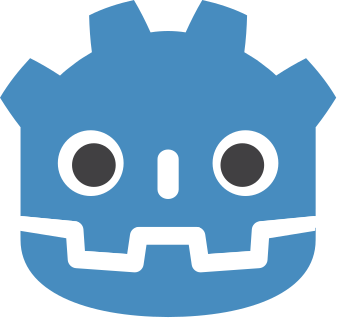

# </a> Ruben Vincent Caleb

`Software Developer | ReactJs, TypeScript, C++`

Hey, I'm Ruben Caleb. I study Computer Science & Mathematics at North-West University and build fast, interactive web experiences, mostly with React.js, TypeScript, and C++.

I care about clean UX, simple performance, and code that's easy to maintain. I love turning messy problems into clear, usable tools.

   

       
       
      
   

## Languages and Tools

### <strong>Web development</strong>

     
     
     
     
      
    
    

### <strong>Game development</strong>

     
     
     

## Recent Projects

    
    
    
    
    

