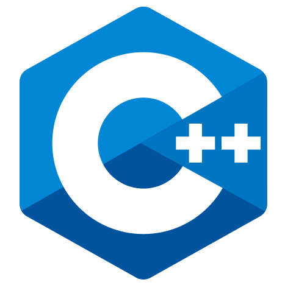
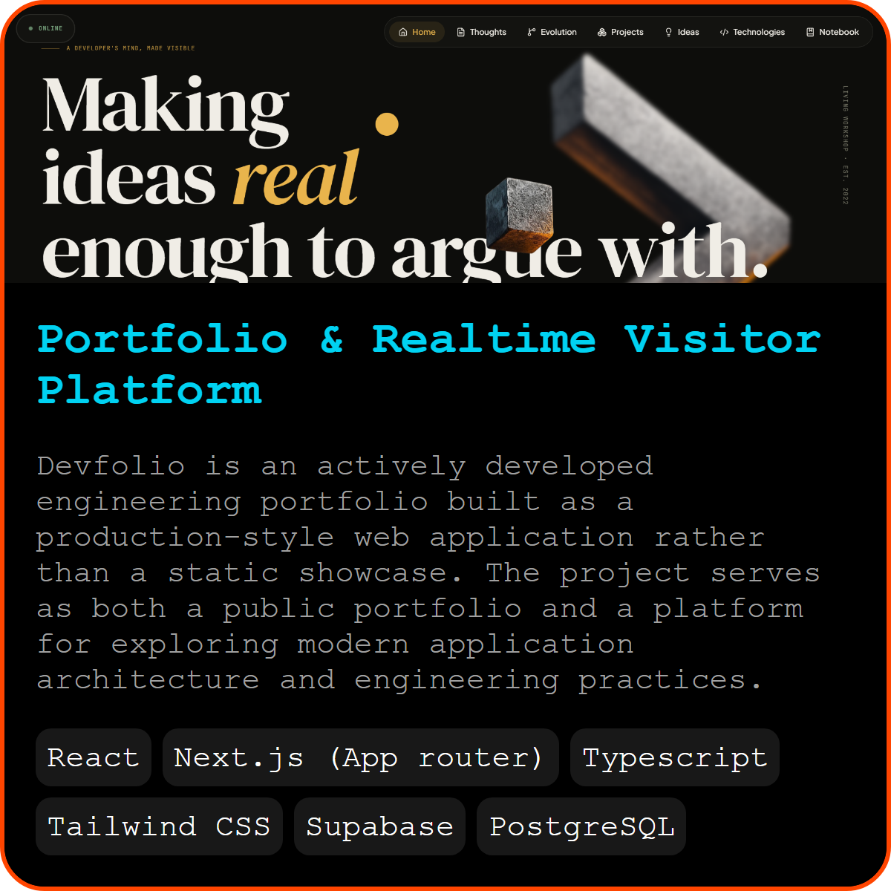
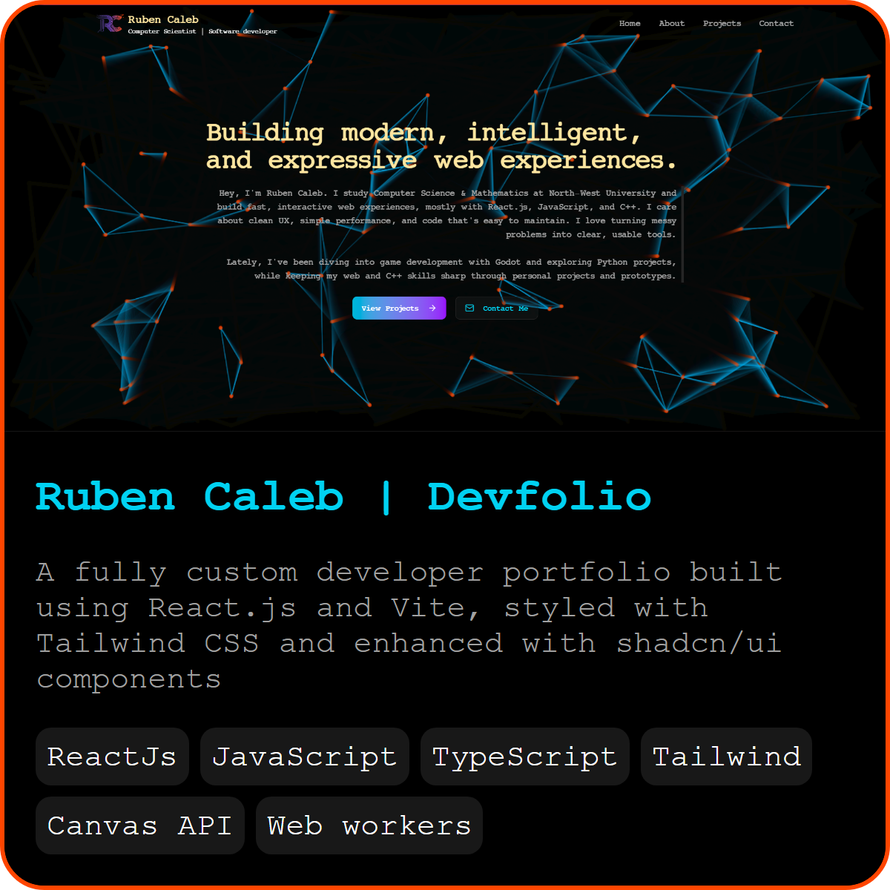
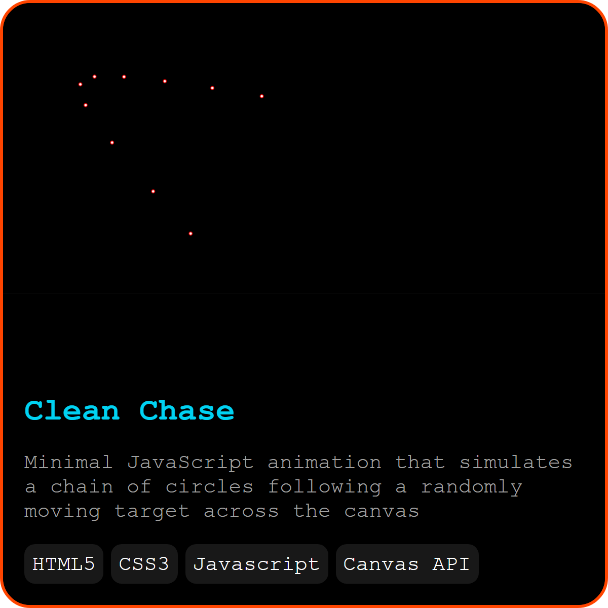
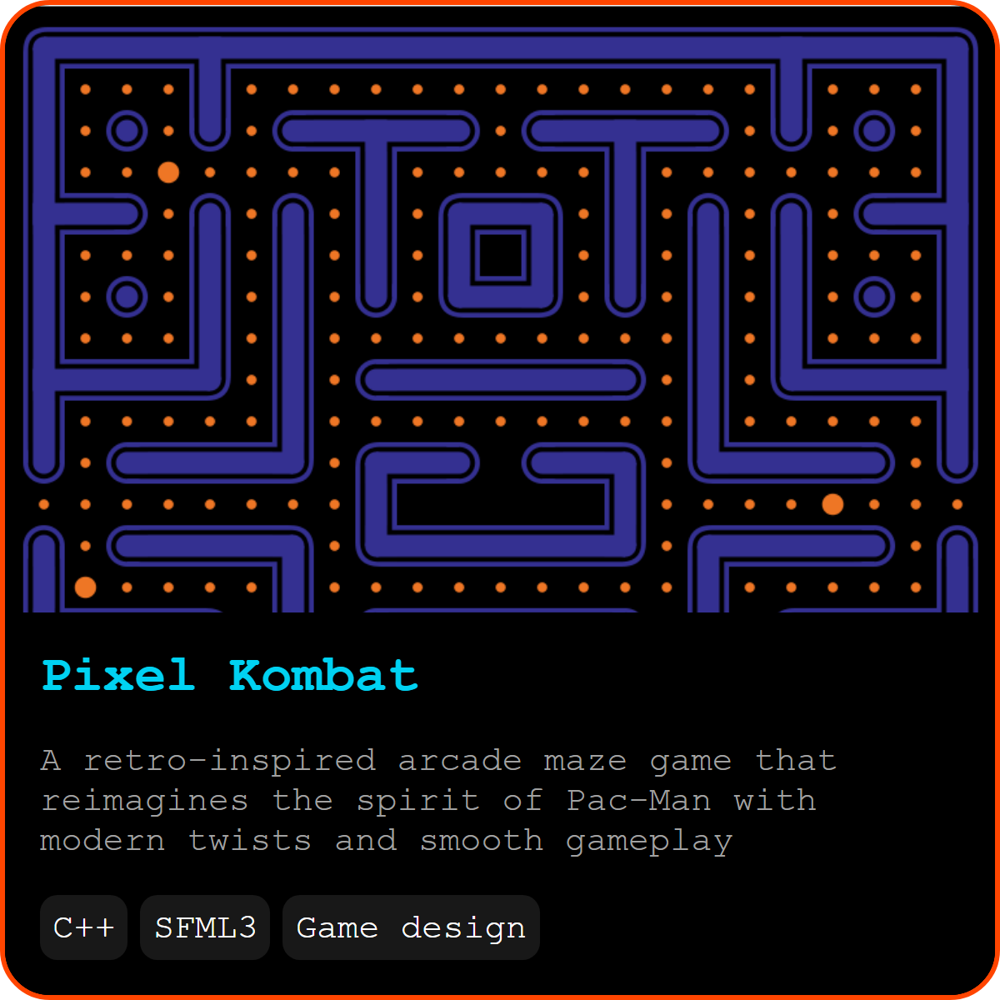
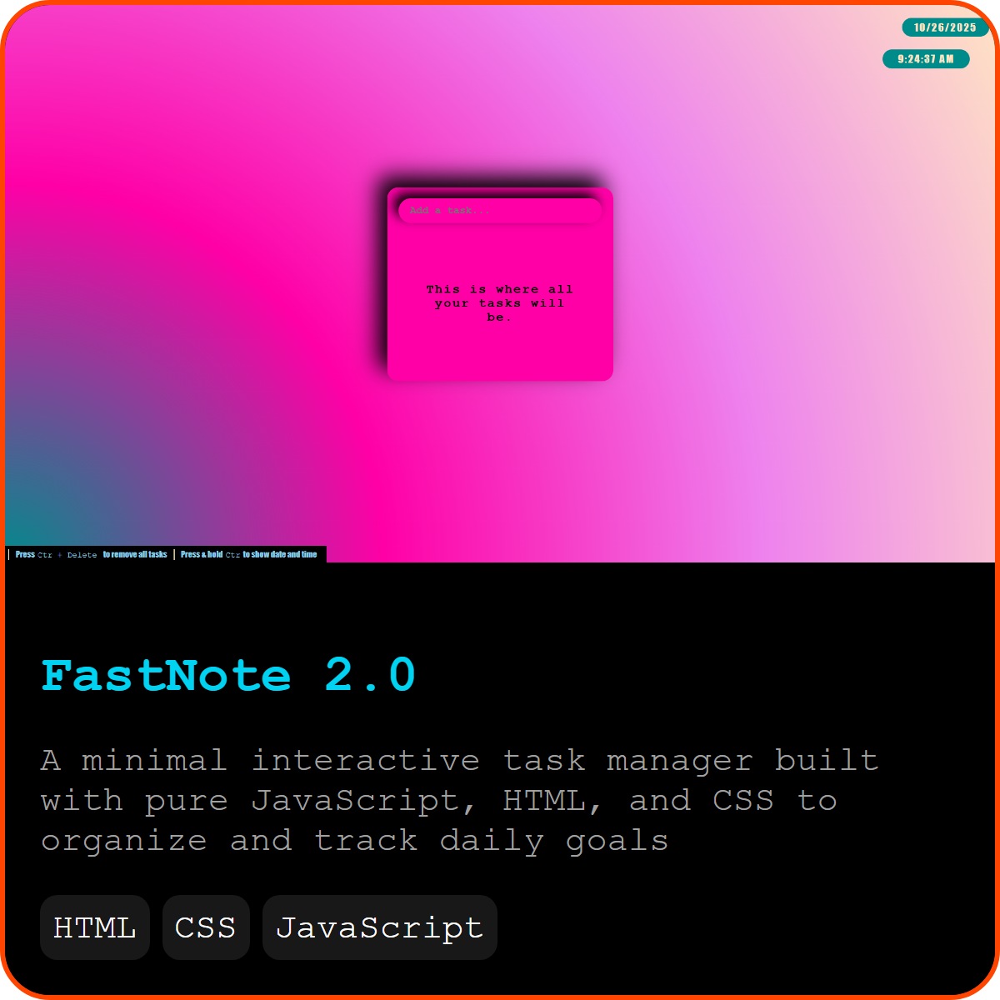
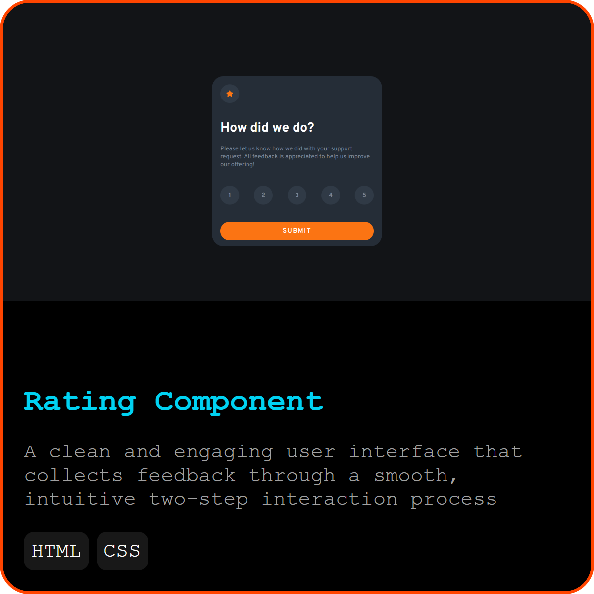

#  Ruben Vincent Caleb

### Software Engineer • Frontend • Full Stack • Systems Design

I enjoy building software that is **clean, interactive, and thoughtfully engineered**. Most of my work revolves around **Next.js, React, TypeScript and Supabase**, where I enjoy solving problems around architecture, realtime systems, state management and developer experience.

I'm currently studying **Computer Science & Mathematics** at **North-West University**, while continuously building personal projects that push my engineering skills beyond the classroom.

I care about software that is pleasant to use, easy to maintain, and designed with intention—not just functionality.

---

      
       
      
   

---

# Tech Stack

### Frontend

     
      
    
    

### Backend & Database

- Next.js Server Actions
- Supabase
- PostgreSQL
- Authentication
- Realtime Systems
- REST APIs

### Languages

    
    
     
    

### Other Tools

- Git
- GitHub
- Playwright
- Figma
- VS Code

---

# Featured Projects

    
    
    
    
    
    

---

# What I'm Building

Most of my recent work focuses on:

- Full-stack web applications
- Realtime communication systems
- Application architecture
- State management
- Developer tooling
- Building projects that improve the way developers work

For deeper project write-ups, architecture decisions, and development notes, visit my Devfolio.

---

# Engineering Interests

I enjoy working on problems involving:

- Software Architecture
- Frontend Engineering
- Backend Systems
- Developer Experience (DX)
- Realtime Applications
- Human-Centered UI/UX
- Automation
- AI-assisted Developer Tools

---

# A Small Fun Fact

The project thumbnails above aren't manually designed.

I built a small Python tool using **Playwright** that renders HTML cards inside a headless browser and automatically generates consistent high-resolution transparent project images for this profile.

Sometimes the best solution is building the tool before building the thing.

---

# Let's Connect

If you'd like to collaborate, discuss software engineering, or simply say hello:

📧 **Email:** klabruben@gmail.com

💼 **LinkedIn:**  
https://www.linkedin.com/in/ruben-caleb-b5243326b/

🌐 **Devfolio:**  
https://devfolio-rv-caleb-v3.vercel.app/

---
